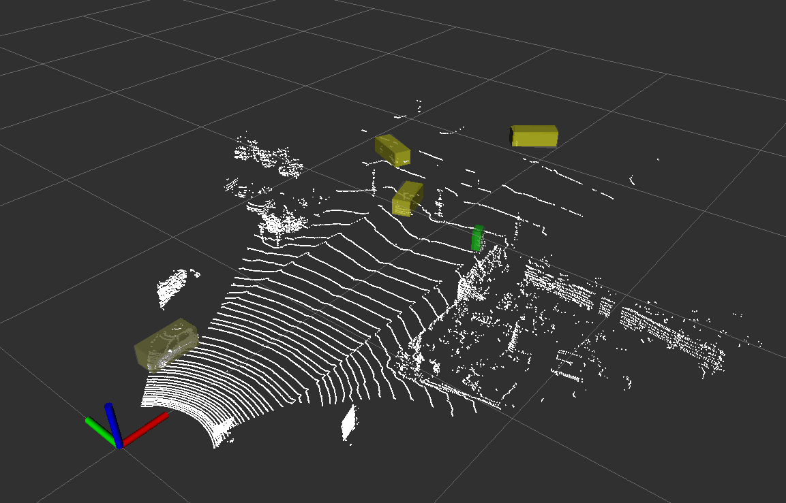

# 激光雷达点云检测

本项目基于Libtorch构建网络，模型训练与推理均采用C++实现，使用ROS可视化

## 网络结构

Pointpillar点特征提取 + Resnet主干网络 + Centerhead检测头

## 效果

## 预训练模型

预训练模型基于KITTI数据集

## 注意事项

### Libtorch与ROS共存问题
Libtorch需要使用ABI版本，否则编译时会出现找不到ROS相关函数实现的问题

## Todo

1. 目前不支持batch维度 训练精度不高
2. 增加使用torch dataset读取数据的代码
